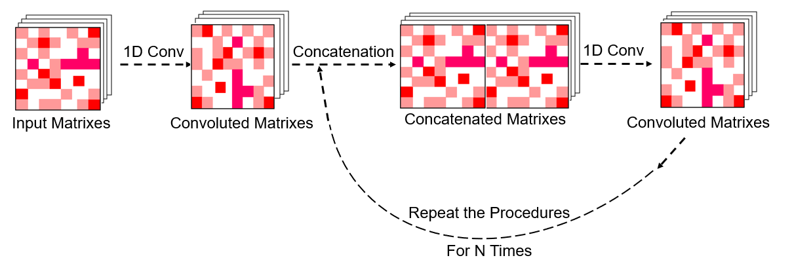
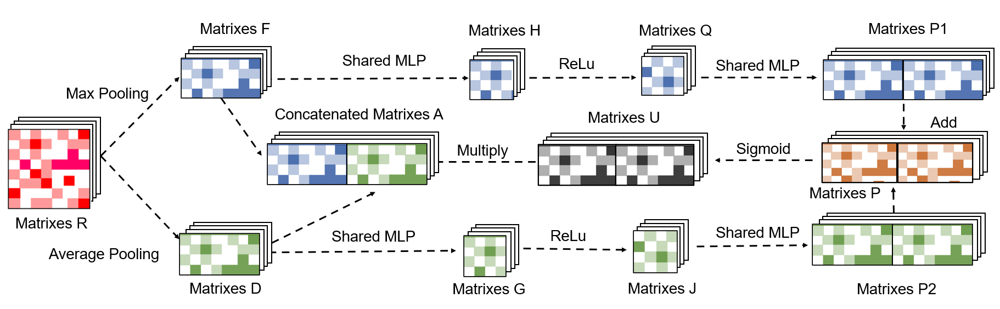

# Fast-AMPs-Discovery-Projects

### Have a fun time with AI calculations!!!

##### Sizhe Chen, Doctor of Medicine, PhD Student at Chinese University of HongKong (Chen2422679942@163.com), supervisor: Professor Francis K. L. Chan and Research Assistant Professor Qi Su

This is a new deep-learning pipeline for AMP predictions. On the independent test dataset, it showed robust prediction performance and potentially avoided high false-positive conditions. Regarding the overall time costs, it only needs 15,374 ± 169 s for training and predictions on a normal laptop. Applying it to the gut microbiomes of cockroach _Blattella germanica_ successfully identified a series of new AMPs with low cytotoxicity and antimicrobial activities in vitro and in vivo. 

The preprint version of our research paper is now available at BioRexiv (The discovery of antimicrobial peptides from the gut microbiome of cockroach Blattella germanica using deep learning pipeline. Sizhe Chen, Huitang Qi, Xingzhuo Zhu, Tianxiang Liu, Yingda Teng, Qiuyu Gong, Cangzhi Jia, Tian Liu. bioRxiv 2024.02.12.580024; doi: https://doi.org/10.1101/2024.02.12.580024). The formal version of this research is currently under review and will be published soon.

By opening and implementing the document Training1.py, you can directly utilize AMPidentifer to train and predict potential AMPs, the details of the created model are written in utils.py.

This repository contains models and data for predicting AMPs described in our paper.

## Requirements
- python 3.9.7 or higher
- keras==2.10.0
- pandas==1.5.2
- matplotlib==3.0.3
- propy3 (tutorial: https://propy3.readthedocs.io/en/latest/UserGuide.html)
- numpy==1.23.5
- sklearn=1.2.0
## Implementation details:

1. The training sequences were deposited in the document TrainingAMP.csv
2. The validation sequences were deposited in the document Validation.csv
3. The test sequences were deposited in the document Non-AMPsfilter.csv

This algorithm demands one-hot code matrix (sequential information，50×20) and physical/chemical descriptors matrix (91×17) as input.
The one-hot code can be calculated by the three .csv documents aforementioned.

For example:\
  ```train_file_name = 'TrainingAMP.csv'  # Training dataset```\
  ```win1 = 50```\
  ```X1, T, rawseq, length = getMatrixLabelh(train_file_name, win1)```

The physical/chemical descriptors matrix can also be calculated by three .csv documents aforementioned,

For example, you can calculate the physical/chemical descriptors matrix by code:\
  ```Matr=getMatrixLabelFingerprint(train_file_name, win1)```
\
And the pre-calculated physical/chemical descriptors matrixes (91×17) have been deposited in 3 .npy documents. You can directly load them by codes:\
\
```X2 = np.load(file="Training_vector.npy")# Descriptor of Training dataset```\
```X2tt = np.load(file="Test_vector.npy")# Descriptor of Test dataset```\
```X2_val = np.load(file="5810_vector.npy")# Descriptor of Validation dataset```\
\
Due to the size limitations of physiochemical descriptors of all sequences, the .npy documents containing these datasets were not submitted to Git Hub. For convenience, you can calculate it by the codes provided in Training1.py. Or you can email chen2422679942@163.com for these documents. 

## AMPidentifer pipeline
It is very easy to train this model. You can open Training1.py in Spyder or Pytorch and just run it. More details or explanations can be found in the annotations of the Training1.py document. 

## Model Prediction Results
The predictions will change slightly for your conditions. If you want to maintain the results of our model reported in our paper, you can load the pre-trained model (.h5 document) deposited in AMPfinder.rar. Other .h5 files of each model strategy generated from iterative training and comparisons can be found in the “Model” directory.

## The Core Part of the Model


Here we designed a new DL pipeline to establish AMP identification tools, including two N-layers computational blocks inspired by previous work of Dense-Net and one embedded new self-attention module proposed in this work, in which the previous Dense-Net is well-known for low scales of fitting parameters and avoidance of gradient vanishing.

## The Mechanisms of the Attention Part


The Attention Part designed in this work improved the overall performance of the AMP prediction task. We assumed that the self-attention module may enhance the recognition of critical features and prevent information loss during training.

Please feel free to contact us if you have any suggestions. Thank you for your attention.

## Citation
The preprint of our work is currently available at bioRexiv (http://dx.doi.org/10.1101/2024.02.12.580024), and the formal paper is under review.  If our work is helpful to your research, you can temporarily cite our work: Sizhe Chen, Huitang Qi, Xingzhuo Zhu, Tianxiang Liu, Yingda Teng, Qiuyu Gong, Cangzhi Jia, Tian Liu. The discovery of antimicrobial peptides from the gut microbiome of cockroach Blattella germanica using deep learning pipeline. bioRexiv; doi: 10.1101/2024.02.12.580024.
