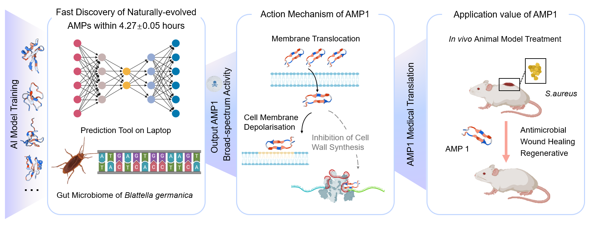

# Fast-AMPs-Discovery-Projects

### Brief Introduction of Developers

#### Developer Introduction

**Sizhe Chen**, PhD Student (Medical Sciences) at Chinese University of Hong Kong (1155202847@link.cuhk.edu.hk). Supervisor: **Professor CHAN Ka Leung Francis** and **Research Assistant Professor Qi Su**. Welcome to contact **Sizhe Chen** via the aforementioned email if you have any questions or suggestions.

This work is supervised by **Professor Tian Liu**, **Professor Cangzhi Jia**, and **Research Associate Fellow Qiuyu Gong**. The research work is primarily finished by **Sizhe Chen** (PhD student), **Huitang Qi** (PhD student), and **Xingzhuo Zhu** (MPhil student) with equal contributions.

#### Acknowledgement
We highly appreciate the academic suggestions and manuscript proofreading by **Professor CHAN Ka Leung Francis**, and **Research Assistant Professor Qi Su** at the Department of Medicine and Therapeutics, Faculty of Medicine, Chinese University of Hong Kong. And we also appreciate the linguistic revision by native citizen **Mrs. Jean O’Donnell** from New York University, U.S.A.

### AI Tool Introduction and Guideline Review
This is a new deep-learning pipeline for AMP predictions. On the independent test dataset, it showed robust prediction performance and potentially avoided high false-positive conditions. Regarding the overall time costs, it only needs 4.27±0.05 hours for training and predictions on a normal laptop. Applying it to the gut microbiomes of cockroach _Blattella germanica_ successfully identified a series of new AMPs with low cytotoxicity and antimicrobial activities in vitro and in vivo. A web interface is also available at http://jiacz-group.cn/AMPidentifer/index.

The preprint version of our research paper is now available at BioRexiv (The discovery of antimicrobial peptides from the gut microbiome of cockroach Blattella germanica using deep learning pipeline. Sizhe Chen, Huitang Qi, Xingzhuo Zhu, Tianxiang Liu, Yingda Teng, Qiuyu Gong, Cangzhi Jia, Tian Liu. bioRxiv 2024.02.12.580024; doi: https://doi.org/10.1101/2024.02.12.580024). The formal version of this research is currently under review and will be published soon.

By opening and implementing the document Training1.py, you can directly utilize AMPidentifer to train and predict potential AMPs, the details of the created model are written in utils.py.

This repository contains models and data for predicting AMPs described in our paper.

## Requirements
- python 3.9.7 or higher
- keras==2.10.0
- pandas==1.5.2
- matplotlib==3.0.3
- propy3 (tutorial: https://propy3.readthedocs.io/en/latest/UserGuide.html)
- numpy==1.23.5
- sklearn=1.2.0
- propy3=1.1.0
## Implementation details:

1. The training sequences were deposited in the document TrainingAMP.csv
2. The validation sequences were deposited in the document Validation.csv
3. The test sequences were deposited in the document Non-AMPsfilter.csv

This algorithm demands one-hot code matrix (sequential information，50×20) and physical/chemical descriptors matrix (91×17) as input.
The one-hot code can be calculated by the three .csv documents aforementioned.

For example:\
  ```train_file_name = 'TrainingAMP.csv'  # Training dataset```\
  ```win1 = 50```\
  ```X1, T, rawseq, length = getMatrixLabelh(train_file_name, win1)```

The physical/chemical descriptors matrix can also be calculated by three .csv documents aforementioned,

For example, you can calculate the physical/chemical descriptors matrix by code:\
  ```Matr=getMatrixLabelFingerprint(train_file_name, win1)```
\
And the pre-calculated physical/chemical descriptors matrixes (91×17) have been deposited in 3 .npy documents. You can directly load them by codes:\
\
```X2 = np.load(file="Training_vector.npy")# Descriptor of Training dataset```\
```X2tt = np.load(file="Test_vector.npy")# Descriptor of Test dataset```\
```X2_val = np.load(file="5810_vector.npy")# Descriptor of Validation dataset```\
\
Due to the size limitations of physiochemical descriptors of all sequences, the .npy documents containing these datasets were not submitted to Git Hub. For convenience, you can calculate it by the codes provided in Training1.py. Or you can contact Sizhe Chen for these documents. 

## AMPidentifer pipeline
It is very easy to train this model. You can open Training1.py in Spyder or Pytorch and just run it. More details or explanations can be found in the annotations of the Training1.py document. 

## Model Prediction Results
The predictions will change slightly for your conditions. If you want to maintain the results of our model reported in our paper, you can load the pre-trained model (.h5 document) deposited in AMPfinder.rar. Other .h5 files of each model strategy generated from iterative training and comparisons can be found in the “Model” directory.

## The Core Part of the Model


Here we designed a new DL pipeline to establish AMP identification tools, including two N-layer computational blocks and one delicately embedded new self-attention module proposed in this work.

## The Mechanisms of the Attention Part


The Attention Part designed in this work improved the overall performance of the AMP prediction task. We assumed that the self-attention module may enhance the recognition of critical features and prevent information loss during training.

## Utilizations Procedures
## 1. You can implement AMPidentifier on your own laptop by opening Training1.py in Spyder or Pytorch.
## 2. Import all necessary functions and packages. (This part has been included in the Training1.py)
import os
import string
from keras.models import Model
from keras.layers.core import Dense, Dropout, Activation
from keras.layers.convolutional import Convolution2D
from keras.layers.pooling import AveragePooling2D, AveragePooling1D
from keras.layers.pooling import GlobalAveragePooling2D, GlobalAveragePooling1D

#from keras.layers import Input, merge, Flatten
from keras.layers import Input
from keras.layers.reshaping import Flatten
from keras.layers import concatenate, add
from keras.layers.normalization import batch_normalization
from keras.layers import BatchNormalization


from keras.regularizers import l2
import keras.backend as K
from keras.layers import Conv1D, Conv2D, MaxPooling2D


import matplotlib.pyplot as plt
import numpy as np
from sklearn import metrics
from sklearn import preprocessing
from sklearn.model_selection import train_test_split, KFold, cross_val_score
from utils import getMatrixLabel, Phos1, getMatrixInput, getMatrixInputh, getMatrixLabelFingerprint, getMatrixLabelh, plot_ROC
from keras.optimizers import adam_v2
#from utils import channel_attenstion

import matplotlib.pyplot as plt

from keras.utils.vis_utils import plot_model
#
import csv
import numpy as np
import keras.utils.np_utils as kutils
from keras.optimizers import adam_v2
from keras.layers import Conv1D, Conv2D, MaxPooling2D
from keras.regularizers import l2
from keras.layers.core import Dense, Dropout, Activation
from keras.layers.pooling import AveragePooling2D, AveragePooling1D
#from keras.layers import Input, merge, Flatten
from keras.layers import Input
from keras.layers.reshaping import Flatten
from keras.layers import concatenate, add
from keras.models import Sequential, Model
import numpy as np
import keras.utils.np_utils as kutils
from propy.GetProteinFromUniprot import GetProteinSequence
from propy.PyPro import GetProDes
from propy.GetProteinFromUniprot import GetProteinSequence
from propy.GetProteinFromUniprot import GetProteinSequence
from propy.GetProteinFromUniprot import GetProteinSequence as gps
from propy import GetSubSeq
from propy.GetProteinFromUniprot import GetProteinSequence
from propy.AAComposition import CalculateAAComposition
from propy.AAComposition import CalculateAADipeptideComposition
from propy.AAComposition import GetSpectrumDict
from propy.AAComposition import Getkmers
from sklearn.preprocessing import StandardScaler

## 3. Calculate descriptors for each given sequence provided in csv document. (The exact format is the same as the csv document provided in this github link)
train_file_name = 'TrainingAMP.csv'  # Training dataset
win1 = 50

X1, T, rawseq, length = getMatrixLabelh(train_file_name, win1)
train_file_name = 'Non-AMPsfilter.csv'  # Test dataset

win1 = 50
X1tt, y_train1, rawseq1, length = getMatrixLabelh(train_file_name, win1)

train_file_name = 'Validation.csv' #Validation dataset
win1 = 50
X_val, y_train111, rawseq116, length = getMatrixLabelh(train_file_name, win1)

X2 = np.load(file="Training_vector.npy")# Descriptor of Training dataset;X2 = np.load(file="Training_vector.npy")
X2tt = np.load(file="Test_vector.npy")# Descriptor of Test dataset
X2_val = np.load(file="5810_vector.npy")# Descriptor of Validation dataset
#Constructing Matrix
aaa = np.zeros((43404+5810, 50, 20))
bbb = np.zeros((43404+5810, 91, 17))
aaa[:43404] = X1[:]
aaa[43404:] = X_val[:]
bbb[:43404] = X2[:]
bbb[43404:] = X2_val[:]

ddd = np.zeros(shape=(43404+5810, 2))
ddd[:43404] = T[:]
ddd[43404:] = y_train111[:]

## 4. Model training by using the training data, fine-tune hyperparameters by using the validation dataset, and assess performances by using the test dataset.
img_dim1 = aaa.shape[1:]

img_dim2 = aaa.shape[1:]

img_dim3 = bbb.shape[1:] #img_dim3 = aaa.shape[1:]

img_dim4 = bbb.shape[1:] #img_dim4 = aaa.shape[1:]


init_form = 'RandomUniform'
learning_rate = 0.0005
nb_dense_block = 9
nb_layers = 9
nb_filter = 36
growth_rate = 36
filter_size_block1 = 11
filter_size_block2 = 7
filter_size_block3 = 11
filter_size_block4 = 7
filter_size_ori = 1
dense_number = 36
dropout_rate = 0.2
dropout_dense = 0.2
weight_decay = 0.000001
nb_batch_size = 512
nb_classes = 2
nb_epoch = 6

model1 = Phos1(nb_classes, nb_layers, img_dim1, img_dim2, img_dim3,img_dim4, init_form, nb_dense_block,
              growth_rate, filter_size_block1, filter_size_block2, filter_size_block3,filter_size_block4,
              nb_filter, filter_size_ori,dense_number, dropout_rate, dropout_dense, weight_decay)

#print(model1.summary())
# plot_model(model1, to_file='DTLDephos.png',
#            show_shapes=True, show_layer_names=True)

opt = adam_v2.Adam(learning_rate=learning_rate,
                   beta_1=0.9, beta_2=0.999, epsilon=1e-08)

model1.compile(loss='binary_crossentropy',optimizer=opt,metrics=['accuracy'])

history = model1.fit([aaa[:43404],aaa[:43404],bbb[:43404],bbb[:43404]], ddd[:43404], batch_size=nb_batch_size,validation_data=([aaa[43404:49214],aaa[43404:49214],bbb[43404:49214],bbb[43404:49214]], ddd[43404:49214]),epochs=nb_epoch, shuffle=True, verbose=1)

5. Make predictions and obtain the probability of being AMP or non-AMP for a given sequence.

Please feel free to contact us if you have any suggestions. Thank you for your attention.
