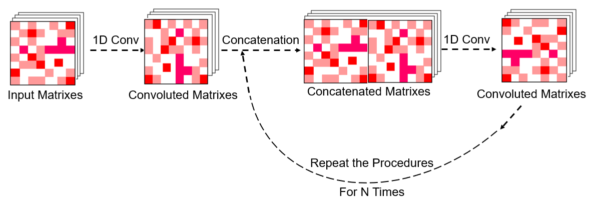

# Fast-AMPs-Discovery-Projects


This research has been accepted by **_Microbiome_** with citation format:  

[1] **Sizhe Chen#**, Huitang Qi#, Xingzhuo Zhu#, Tianxiang Liu, Yutin Fan, Qi Su, Qiuyu Gong*, Cangzhi Jia*, Tian Liu*. Screening and identification of antimicrobial peptides from the gut microbiome of cockroach _Blattella germanica_. **_Microbiome_** 2024, 12: 272. IF=16.837 doi: **10.1186/s40168-024-01985-9**.

### Brief Introduction of Developers
#### Developer Introduction

**Sizhe Chen**, PhD Student (Medical Sciences) at Chinese University of Hong Kong (1155202847@link.cuhk.edu.hk). Supervisor: **Professor CHAN Ka Leung Francis** and **Research Assistant Professor Qi Su**. Welcome to contact **Sizhe Chen** via the aforementioned email if you have any questions or suggestions.

This work is supervised by **Professor Tian Liu**, **Professor Cangzhi Jia**, and **Research Associate Fellow Qiuyu Gong**. The research work is primarily finished by **Sizhe Chen** (PhD student), **Huitang Qi** (PhD student), and **Xingzhuo Zhu** (MPhil student) with equal contributions.

#### Acknowledgement
We highly appreciate the academic suggestions and manuscript proofreading by **Professor CHAN Ka Leung Francis**, and **Research Assistant Professor Qi Su** at the Department of Medicine and Therapeutics, Faculty of Medicine, Chinese University of Hong Kong. And we also appreciate the linguistic revision by native citizen **Mrs. Jean O’Donnell** from New York University, U.S.A.

### AI Tool Introduction and Guideline Review
This is a new deep-learning pipeline for AMP predictions. On the independent test dataset, it showed robust prediction performance and potentially avoided high false-positive conditions. Regarding the overall time costs, it only needs 4.27±0.05 hours for training and predictions on a normal laptop. Applying it to the gut microbiomes of cockroach _Blattella germanica_ successfully identified a series of new AMPs with low cytotoxicity and antimicrobial activities in vitro and in vivo. A web interface is also available at http://jiacz-group.cn/AMPidentifer/index.

By opening and implementing the document Training1.py, you can directly utilize AMPidentifer to train and predict potential AMPs, the details of the created model are written in utils.py.

This repository contains models and data for predicting AMPs described in our paper.

## Requirements
- python 3.9.7 or higher (3.9.7 is recommended as priority)
- keras==2.10.0
- pandas==1.5.2
- matplotlib==3.0.3 (not compulsory)
- propy3 (tutorial: https://propy3.readthedocs.io/en/latest/UserGuide.html)
- numpy==1.23.5
- sklearn=1.2.0
- propy3=1.1.0
- gensim=4.2.0 or 4.3.0
- scipy=1.9.3
- tensorflow=2.10.0 (it may raise errors if tensorflow is installed by default "pip install tensorflow"; Please indicate tensorflow=2.10.0 specifically)
## Implementation details:

1. The training sequences were deposited in the document TrainingAMP.csv
2. The validation sequences were deposited in the document Validation.csv
3. The test sequences were deposited in the document Non-AMPsfilter.csv

This algorithm demands one-hot code matrix (sequential information，50×20) and physical/chemical descriptors matrix (91×17) as input.
The one-hot code can be calculated by the three .csv documents aforementioned.

For example:\
  ```train_file_name = 'TrainingAMP.csv'  # Training dataset```\
  ```win1 = 50```\
  ```X1, T, rawseq, length = getMatrixLabelh(train_file_name, win1)```

The physical/chemical descriptors matrix can also be calculated by three .csv documents aforementioned,

For example, you can calculate the physical/chemical descriptors matrix by code:\
  ```Matr=getMatrixLabelFingerprint(train_file_name, win1)```
\
And the pre-calculated physical/chemical descriptors matrixes (91×17) have been deposited in 3 .npy documents. You can directly load them by codes:\
\
```X2 = np.load(file="Training_vector.npy")# Descriptor of Training dataset```\
```X2tt = np.load(file="Test_vector.npy")# Descriptor of Test dataset```\
```X2_val = np.load(file="5810_vector.npy")# Descriptor of Validation dataset```\
\
Due to the size limitations of physiochemical descriptors of all sequences, the .npy documents containing these datasets were not submitted to Git Hub. For convenience, you can calculate it by the codes provided in Training1.py. Or you can contact Sizhe Chen for these documents. 

## AMPidentifer pipeline
It is very easy to train this model. You can open Training1.py in Spyder or Pytorch and just run it. More details or explanations can be found in the annotations of the Training1.py document. 

## Model Prediction Results and Analysis
The predictions will change slightly for your conditions. If you want to maintain the results of our model reported in our paper, you can load the pre-trained model (.h5 document) deposited in AMPfinder.rar. Other .h5 files of each model strategy generated from iterative training and comparisons can be found in the “Model” directory.

## The Core Part of the Model


Here we designed a new DL pipeline to establish AMP identification tools, including two N-layer computational blocks and one delicately embedded new self-attention module proposed in this research.

## The Mechanisms of the Attention Part


The Attention Part designed in this work improved the overall performance of the AMP prediction task. We assumed that the self-attention module may enhance the recognition of critical features and prevent information loss during training.

## Utilizations Procedures
1. You can implement AMPidentifier on your own laptop by opening Training1.py in Spyder or Pytorch.
2. Import all necessary functions and packages. (This part has been included in the Training1.py) **(Lines 1-67 in Training1.py)**
3. Calculate descriptors for each given sequence provided in csv document. **(The exact format is the same as the csv document provided in this github link, lines 69-97 in Training1.py)**
4. Model training by using the training data, fine-tune hyperparameters by using the validation dataset, and assess performances by using the test dataset. **(Lines 98-156 in Training1.py)**
5. Make predictions and obtain the probability of being AMP or non-AMP for a given sequence. **(Lines 158 in Training1.py)**

Please feel free to contact us if you have any suggestions. Thank you for your attention.
